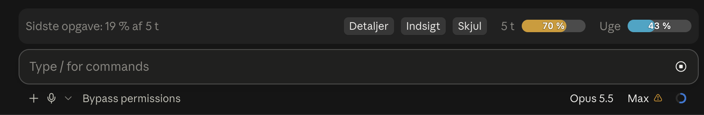

# Token-måler til Claude Code



Viser, hvor meget af dine grænser (5 timer og ugen) projektet, hver opgave og hver dag brugte, og hvad der brugte mest. Kroner står som ekstra.

- `/tokens` viser hele projektets forbrug i alt og opgaverne sorteret efter de dyreste, hver med en kort beskrivelse af, hvad Claude udførte.
- `/tokens 3` udvider opgave 3: hvad forbruget gik til, og hvorfor den blev dyr.
- `/tokens dage` viser de aktive dage, og `/tokens dag 2` viser dag 2 med dagens dyreste opgaver.
- `/tokens Kundekrigen` viser en anden session i samme projektmappe (en del af titlen er nok).
- Efter hver opgave vises et bånd over prompten med den seneste opgaves andel af 5-timersgrænsen, knapperne **Detaljer**, **Indsigt** og **Skjul** og målere for 5-timersgrænsen og ugens grænse (billedet øverst).
- Du kan også spørge Claude, fx "hvad kostede opgave 4?" eller "hvor mange dage har vi arbejdet på det her?".
- **Indsigt** (knappen i båndet og panelet, `/tokens indsigt` eller `/tokens råd alle`) viser på tværs af alle dine samtaler, i denne rækkefølge: grænserne som målere; dit gennemsnitlige forbrug pr. ugedag over hele historikken; alle samtaler (antal, aktive dage, forbrug i alt); ugens dyreste samtaler i ugegrænsens eget vindue (fra den sidst blev nulstillet, ellers de seneste 7 dage); og gode råd til dig. Graferne tegnes i desktop-appen; i terminalen står de som tekst. I en ny samtale står "Bliv klogere på dit forbrug og dine prompts" over prompten med knapperne **Indsigt** og **Dine prompts**.
- `/tokens råd` viser analytikerens råd til at bruge færre tokens, hver med et skøn over, hvad det kunne have sparet. Rådene står i panelet under knappen **Råd**.
- **Dine prompts** (knappen ved siden af Indsigt, `/tokens prompts` eller `/prompts`) finder steder, hvor din første prompt manglede noget, så du måtte rette bagefter, og foreslår, hvordan prompten kunne have lydt. Tre modeller deler arbejdet: Claude Opus analyserer dine 8 dyreste samtaler, Claude Sonnet skriver den bedre prompt på dit eget niveau (samme sprog og tone, højst halvanden gang så lang), og Claude Haiku skriver forklaringerne. Tallet er, hvad rettelserne bagefter brugte. Forslagene gemmes, så en samtale kun gennemgås igen, når den har fået nye beskeder.
- Hvert råd står på højst tre linjer: hvad det kunne have sparet, hvad analytikeren så, og hvad du kan gøre.

Mod'en læser sessionens egne tal og transcript-filer på din egen maskine. For at beskrive opgaverne sender den korte uddrag (din besked, Claudes svar og hvilke filer der blev rørt) til Claude Haiku over samme forbindelse som samtalen; hver beskrivelse gemmes, så det sker én gang pr. opgave og koster under en øre. Ellers sender den intet ud.

## Installation

Kræver en ny version af Claude Code (testet på 2.1.289) på macOS eller Linux.

**Som plugin (anbefalet).** Mappen `claude-mods` er et plugin-katalog. Har du adgang til GitHub-repoet, så kør:

```bash
claude plugin marketplace add Ludomajn/claude-mods
```

Har du fået mappen som zip, så pak den ud og giv stien i stedet, fx `claude plugin marketplace add ~/claude-mods`. Installér derefter:

```bash
claude plugin install token-maaler@claude-mods
```

I Claude-appen kan du også installere den under **+** ved prompten → **Plugins** → **Add plugin**, når kataloget er tilføjet. Genstart appen, og skriv `/tokens`.

**Uden katalog.** Læg mappen `token-maaler` et fast sted, og tilføj stien i `~/.claude/settings.json` under `"env"`: `"CLAUDE_CODE_PLUGIN_DIRS": "/Users/DIT-BRUGERNAVN/claude-mods/token-maaler"`. Har du allerede stier dér, så sæt dem efter hinanden med `:` imellem.

## Indstillinger

Under `/config` står mod'ens indstillinger; alle er slået til fra start:

- **Velkomst i nye samtaler**: "Bliv klogere på dit forbrug og dine prompts" med knapperne Indsigt og Dine prompts.
- **Bånd efter hver opgave**: målere for 5-timersgrænsen og ugens grænse, hvad den seneste opgave brugte, og knapperne Detaljer og Indsigt i højre side. Rådene står i panelet under Råd.
- **Kroner pr. dollar**: kursen, listepriserne omregnes til kroner med (standard 6,5).
- **Beskeder**: en kort besked efter hver opgave med forbruget og hvor lang tid den tog.
- **Dine prompts**: knappen Dine prompts ved siden af Indsigt. Gennemgangen sender uddrag af dine samtaler til Opus, Sonnet og Haiku og koster typisk under 7 kr.
- **Beskrivelser af opgaver**: Claude Haiku skriver en kort beskrivelse af hver opgave. Slå den fra, hvis intet fra samtalen må sendes til en beskrivelse.

## Sådan regnes det

Hvert modelkald melder sine egne tokens. Et værktøjsresultat (fx en fil, der læses) bliver i samtalen og læses igen i alle senere runder, så mod'en tæller det med dér.

Historikken pr. dag kommer fra sessionens transcript-filer i `~/.claude/projects`. En dag er en kalenderdag i din egen tidszone, og dag 1 er den første dag med aktivitet. Kald i baggrunden (titler, forslag) står ikke i transcriptet og er ikke med.

Hovedtallet er andelen af dine grænser på abonnementet: 5-timersgrænsen og ugens grænse. Claude Code kender kun grænserne som procent, så mod'en måler dem: når en grænse flytter sig, lægger den listeprisen for alle modelkald i grænsens vindue sammen (fra alle dine transcripts) og deler med procenten. Medianen af de seneste ti målinger bruges, så én skæv måling ikke flytter tallene. Forbrug uden for Claude Code (fx claude.ai) tæller med i grænsen, men ikke i transcriptet, så andelene er snarere for høje end for lave. Før den første måling, og uden abonnement, vises kroner. Kroner er Anthropics listepriser omregnet med kursen i `/config`.

## Analytikerens råd

Analytikeren gennemgår hele projektet, når du åbner **Råd** i panelet eller skriver `/tokens råd`. Reglerne i dag:

- Lang samtale: hver runde læser hele samtalen igen; `/compact` eller en ny session gør det billigere.
- Pauser: efter cirka en time skal hele samtalen skrives til cachen igen.
- Store værktøjsresultater: hele filer og lange output, der læses igen i de følgende runder.
- Tænkning og subagenter, når de fylder meget af prisen.
- Rutineopgaver som commit og push i en lang samtale.
- Subagenter på xhigh eller max effort, når de udgør mindst halvdelen af subagenternes pris. Forskellen til high måles i dine egne data, når der er nok af begge.
- En dyrere model end standardmodellen (Opus 5.5) i chatten: hvad samme arbejde havde kostet på standardmodellen. En dyrere klasse (fx Fable) får rådet at bruge den til det sværeste; en ældre version (fx Opus 5) får rådet at skifte.
- Skærmbilleder: hvert billede (ca. 1.500 tokens) læses igen i resten af opgaven; at læse siden som tekst er billigere.
- Fejlede værktøjskald: hver fejl koster en ekstra runde. Rådet afhænger af den hyppigste slags (kommandoer, tilladelser eller timeouts); kald, du selv afviste, tæller ikke.
- Forbrugsgrænsen: subagenter, der stoppede midt i arbejdet, fordi grænsen blev nået.
- Forbindelser og plugins, der følger med i hver runde (kun for den aktive session).

Alle skøn er regnet ud fra den enkelte brugers egne transcripts, ikke ud fra faste antagelser om, hvordan man arbejder. Et kald tæller med sit endelige output, og en forgrenet samtale tæller ikke den kopierede historik med igen.

### Sådan tilføjer du et råd

Reglerne står i `hooks/raad.ts`. En regel er en funktion, der får projektet og hver opgaves analyse og giver nul eller flere råd tilbage: `navn` (få ord), `hvorfor` (hvad der skete, med tal), `handling` (hvad man gør, og hvorfor det hjælper), `kort` (handlingen i få ord til `/tokens`-oversigten), `eksempler` og et skøn i dollars (listepris; mod'en viser det som andel af grænserne eller i kroner). Skriv funktionen, og sæt den i listen `REGLER`. `/tokens råd`, Indsigt på tværs af samtaler, panelet og Claudes værktøj bruger den så automatisk. Hæv `INDSIGT`-versionen i `hooks/register.tsx`, så gemte resumeer regnes igen.
